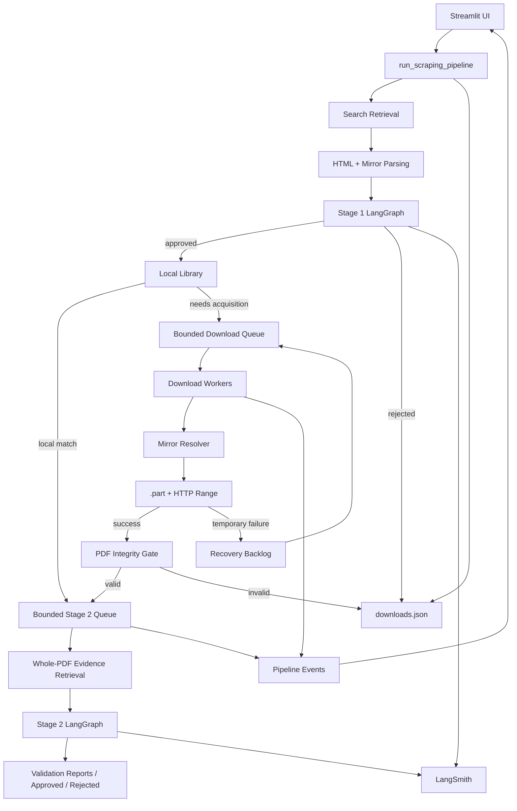

# Architecture

This document describes the current architecture of Agentic Scraper as implemented in the repository today.

It is intentionally different from a future-state architecture proposal: this file focuses on the runtime paths that actually exist in the current root Streamlit implementation and the current Colab implementation.

## 1. Architectural classification

Agentic Scraper is a **hybrid event-driven agentic pipeline**.

It combines:

- sequential dependencies between logical stages;
- bounded parallelism inside independent stages;
- producer/consumer queues between acquisition and validation work;
- deterministic Python for network, files, retries, state, integrity and scheduling;
- LangGraph for explicit semantic workflow orchestration;
- CrewAI/OpenRouter only where semantic reasoning is needed;
- event-driven UI telemetry;
- durable lifecycle state for restart/recovery.

The core engineering rule is:

> LLMs make semantic decisions; deterministic Python owns operational decisions.

## 2. Root Streamlit architecture



## 3. Main runtime controller

The root application is orchestrated by `run_scraping_pipeline()` in `app.py`.

Its responsibilities currently include:

1. initializing the run and runtime identifiers;
2. restoring interrupted Stage 2 and download work;
3. refreshing the local library index;
4. discovering search pages;
5. parsing document rows and mirrors;
6. invoking Stage 1;
7. admitting approved jobs into a bounded global download queue;
8. continuously draining worker outcomes while later pages are still discovered;
9. draining primary work;
10. executing global recovery rounds;
11. coordinating Streamlit-safe telemetry;
12. returning run summary counters.

This is the primary reason `app.py` is large: it is both an entry point and a controller for several subsystems.

## 4. Semantic architecture

### Stage 1

Stage 1 lives in `app/agents/orchestrator.py`.

The graph is deliberately minimal:

```text
START
  |
  v
evaluate_documents
  |
  v
END
```

Its role is to decide which discovered metadata records are worth acquiring.

A page-level batch is evaluated in a single CrewAI task. The model returns integer document IDs only, and Python maps those IDs back to the original trusted source records.

This design avoids allowing the LLM to rewrite trusted URLs or document identity.

### Stage 2

Stage 2 has a separate graph:

```text
START
  |
  v
validate_pdf_content
  |
  v
END
```

It evaluates bounded local evidence extracted from the actual PDF rather than relying only on search metadata.

For the main acquisition workflow, Stage 2 distinguishes:

- whether ASHRAE is genuinely the issuer/publisher;
- whether the PDF is substantively relevant to the user's query.

The normalized semantic outcomes are:

```text
APPROVED
REJECTED
PENDING
```

Ambiguous or malformed model results become `PENDING` rather than being silently accepted.

## 5. Discovery architecture

For each search page, the root runtime attempts retrieval through a fallback chain:

```text
ZenRows
  -> direct curl_cffi browser request
  -> curl_cffi + Cloudflare DoH
  -> curl_cffi + Google DoH
  -> local search cache
```

BeautifulSoup then extracts:

- evaluator-safe document records;
- row-scoped mirror groups;
- provenance such as source page and item number.

A critical invariant is that mirrors remain associated with the result row from which they were discovered. The application avoids merging mirrors by title because title collisions can associate a binary route with the wrong document.

## 6. Stable document identity

`app/pipeline_state.py` contains `stable_document_id()`.

Identity strategy:

```text
Libgen MD5 available
    -> libgen-md5:<md5>

otherwise
    -> canonical source URL + title
    -> source-sha256:<digest>
```

This identity is independent of the presentation filename and allows multiple mirror URLs to represent one logical document.

## 7. Lifecycle model

The root ledger remains backward-compatible with older flat records while adding a canonical lifecycle view.

Conceptually:

```json
{
  "document_id": "libgen-md5:...",
  "title": "...",
  "source_metadata": {},
  "discovery": {
    "status": "DISCOVERED"
  },
  "stage1": {
    "status": "APPROVED",
    "completed": true
  },
  "download": {
    "status": "COMPLETED",
    "document_attempt": 2,
    "bytes_downloaded": 45123456,
    "part_path": "...",
    "last_error": null
  },
  "stage2": {
    "status": "APPROVED",
    "completed": true
  },
  "final_status": "ACCEPTED"
}
```

Common final states include:

```text
ACCEPTED
REJECTED
PDF_INVALID
STAGE1_REJECTED
DOWNLOAD_FAILED
IN_PROGRESS
```

## 8. Durable state store

The root persistent download ledger is:

```text
data/downloads.json
```

Writes are protected through:

```text
thread lock
+ process-level OS file lock
+ unique temporary file
+ flush/fsync
+ atomic os.replace
```

The durability goal is to preserve the previous valid ledger even when a new write fails.

The physical `.part` file remains authoritative for the actual resume byte offset.

## 9. Download scheduling

The primary root scheduler is `GlobalDownloadQueue` in `app/pipeline_scheduler.py`.

Properties:

- one fixed `ThreadPoolExecutor`;
- bounded queue;
- explicit backpressure;
- worker count does not exceed configuration;
- caller owns recovery policy;
- workers execute one bounded document attempt and return outcomes.

Root defaults:

```text
5 download workers
50 download-queue slots
```

The global recovery scheduler is `GlobalRecoveryBacklog`.

Exact attempt rule:

```text
completed failure attempt n
    -> schedule n + 1

n == max attempts
    -> terminal
```

This prevents impossible attempt states such as `6/5`.

## 10. Download worker architecture

A download worker performs one document-level attempt.

Within the attempt:

1. persist `DOWNLOADING` state;
2. obtain network admission/proxy state;
3. resolve candidate mirror pages;
4. choose direct binary routes;
5. use `curl_cffi` to stream the PDF;
6. write to `.part`;
7. resume via `Range` when a partial exists;
8. emit throttled progress events;
9. make bounded same-source request retries;
10. return success, temporary failure, or terminal failure.

Request retry budget and document recovery are deliberately separate.

A worker should not remain occupied for an entire multi-round recovery lifecycle.

## 11. NetworkManager ownership

`app/network_manager.py` owns network-wide state:

- reusable thread-local sessions;
- optional proxy selection;
- new-transfer pacing;
- per-route cooldowns;
- gateway health score;
- `Retry-After` handling;
- route eligibility deadlines;
- worker events;
- optional throughput/distributed hooks.

Root configuration is loaded from `config/settings.yaml`.

## 12. Progress and persistence architecture

`app/download_progress.py` separates high-frequency binary streaming from expensive durable state writes.

Default policy:

```text
stream chunk                 256 KiB
state time threshold         2 s
state byte threshold         8 MiB
progress event threshold     0.5 s
```

Lifecycle writes still happen immediately.

The throttling exists to avoid turning large downloads into hundreds of JSON ledger writes.

## 13. Stage 2 queue architecture

`BoundedWorkQueue` is used for Stage 2 handoff.

Default root configuration:

```text
2 validation workers
20 Stage 2 queue slots
```

If the queue is full, the document is persisted as `PENDING` rather than consuming unbounded memory or blocking download workers.

Pending work can be reconstructed after restart.

## 14. PDF integrity and evidence architecture

The Stage 2 path is split into deterministic and semantic phases.

### Deterministic structural gate

`check_pdf_integrity()` checks:

```text
exists
non-zero
minimum size
%PDF- signature
strict PyPDF parsing
>= 1 page
```

Technical failures never need an LLM call.

### Whole-PDF evidence retrieval

`retrieve_pdf_evidence()` scans locally extractable pages and ranks bounded chunks for two independent topics:

```text
ASHRAE publisher identity
query relevance
```

The output retains page labels and is bounded before being sent to Stage 2.

## 15. Content deduplication

After a completed file exists, the root runtime computes SHA-256 incrementally.

For byte-identical PDFs in the same query context:

- the canonical file can own the Stage 2 decision;
- duplicates can become `DUPLICATE_PENDING` while canonical validation is running;
- a terminal canonical result can be inherited by the duplicate;
- physical duplicate files are not automatically deleted.

This avoids repeated LLM evaluation without conflating source identity with content identity.

## 16. Event-driven UI architecture

Worker threads never directly render Streamlit.

Flow:

```text
worker thread
   -> NetworkManager / PipelineEventBus
   -> main Streamlit coroutine
   -> DownloadPresentation / RunMetrics
   -> PipelineDashboardSnapshot
   -> Streamlit widgets
```

This keeps Streamlit calls on the main thread while allowing worker activity to remain visible.

## 17. Observability architecture

`app/observability.py` wraps Stage 1 and Stage 2 with optional LangSmith tracing.

Tracing is intentionally isolated:

- disabled when credentials are absent;
- tracing failures do not fail the pipeline;
- only bounded metadata is passed to the wrapper;
- PDF bytes, full document text and credentials are not accepted as trace payloads by the agent workflow wrapper.

## 18. Local library architecture

`app/local_library.py` maintains a stat-based local PDF index.

Startup indexing uses:

```text
size
mtime
metadata title
normalized filename
```

It does not scan all pages of all PDFs at startup.

Ambiguous normalized-title matches are rejected rather than silently reused.

A local match can skip network acquisition while still going through query-specific validation.

## 19. Root execution overlap

The root runtime is partially pipelined:

```text
page 1 Stage 1 -> queue downloads
                    |
                    +---- workers run while page 2 discovery begins
```

However, Stage 1 itself remains page-blocking:

```text
fetch page
parse page
await Stage 1
queue approvals
then continue next page
```

`stage1_queue_maxsize` exists in configuration, but the inspected root runtime does not currently implement a separate Stage 1 producer/consumer queue.

That is a current throughput limitation and a likely future refactoring target.

## 20. Legacy and current scheduling paths

The repository still contains older helper paths such as `_download_round()` alongside the newer `_StreamlitDownloadCoordinator` and global queue.

The newer coordinator/global queue is the primary root runtime path.

This coexistence is technical debt because multiple scheduling approaches appear valid to a reader even though they are not equally current.

## 21. Colab architecture

The Colab implementation lives under:

```text
Colab_Version/source/
```

Its notebook adapter:

- loads the same style of core pipeline headlessly;
- redirects active storage into `/content`;
- removes Streamlit runtime requirements;
- adds notebook-safe progress rendering;
- optionally snapshots state/PDFs to Google Drive;
- enables scheduler admission and deferred retry passes;
- optionally enables PostgreSQL-backed multi-Colab coordination.

See `docs/COLAB.md` for detail.

## 22. Root vs Colab differences

| Capability | Root Streamlit | Current Colab |
|---|---|---|
| Streamlit UI | Yes | No |
| Headless execution | Internal option | Primary mode |
| Default download workers | 5 | 5 |
| Stage 2 workers | 2 | 2 |
| Fair admission scheduler | Normally off | Enabled |
| Deferred per-pass retries | Normally off | Enabled |
| Drive persistence | No | Optional |
| PostgreSQL coordination | Hooks/scaffolding only | Optional |
| Integrity-before-COMPLETED lifecycle | No | Yes |
| Explicit worker counts above 5 | Root loader clamps to 5 | Colab config permits positive overrides |

The most important divergence is integrity semantics.

Current Colab lifecycle:

```text
transfer finalizes
  -> INTEGRITY_PENDING
  -> structural validation
      -> valid -> COMPLETED
      -> invalid -> recovery/failure
```

The repository-root Streamlit version has not yet been normalized to exactly this lifecycle.

## 23. Current technical debt

### Oversized `app.py`

The main controller also contains substantial persistence, download and UI logic.

A future refactor should extract modules without changing behavior, for example:

```text
app/
├── controller.py
├── discovery.py
├── state_store.py
├── mirror_resolver.py
├── download_worker.py
├── validation_service.py
└── ui/
```

### Stage 1 producer queue not implemented in root

Discovery remains blocked on each page's Stage 1 result.

### Root/Colab integrity divergence

The stronger Colab lifecycle should eventually be ported or the two products should remain explicitly versioned.

### Coexisting legacy scheduling helpers

Older round-oriented helpers should either be removed or clearly labeled as compatibility/test paths.

### Configuration parsing

`NetworkManager` manually parses a limited YAML subset. This is sufficient for the current simple file but fragile if configuration complexity grows.

## 24. Design invariants to preserve

When modifying the architecture, preserve these invariants unless there is a deliberate migration plan:

1. LLMs do not own download/network/filesystem operations.
2. Download concurrency remains bounded.
3. Stage 2 concurrency remains bounded.
4. `.part` files remain resumable artifacts.
5. Filesystem size remains authoritative for Range resume.
6. Retry-After is respected.
7. Mirror provenance is never merged across unrelated documents.
8. Stable source identity is independent of presentation filenames.
9. Invalid/ambiguous LLM output is never treated as approval.
10. Worker threads do not call Streamlit directly.
11. Durable writes are atomic and recoverable.
12. Recovery attempts never exceed configured limits.
13. Structural PDF failures do not require semantic LLM calls.
14. Observability failures do not fail core work.
15. Colab-specific changes are made inside `Colab_Version/source/` and rebundled.
